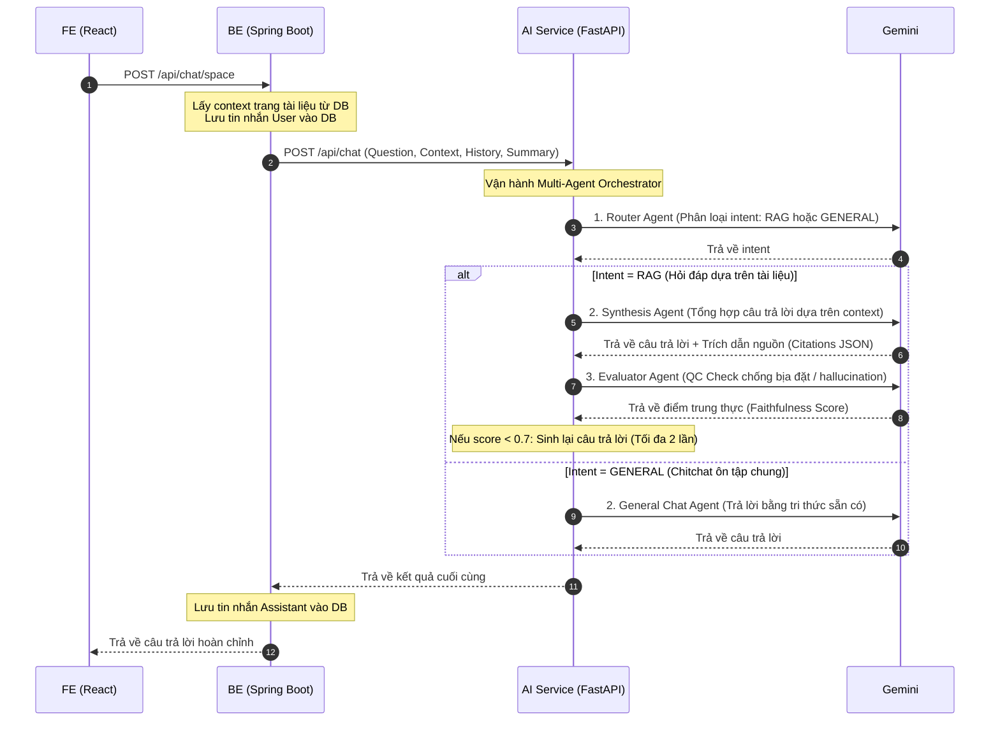

# Mora AI Service

Mora AI Service là một Python-based microservice được xây dựng bằng **FastAPI** và thư viện **Google GenAI SDK** chính thức từ Google. Dịch vụ này chịu trách nhiệm xử lý toàn bộ các tác vụ liên quan đến trí tuệ nhân tạo (AI) và tích hợp mô hình **Gemini** (ví dụ: `gemini-3.1-flash-lite`) cho dự án Mạng xã hội học tập Mora.

Dịch vụ này được kết nối trực tiếp từ Spring Boot backend (`mora-backend`) qua giao thức HTTP REST API.

---

## Tính năng nổi bật

1. **Document Chat (`/api/chat/document`)**: Hỏi đáp trực tiếp trên nội dung tài liệu (hỗ trợ văn bản và phân tích hình ảnh Base64). Tự động rút gọn lịch sử chat.
2. **Space Chat (`/api/chat/space`)**: Hỏi đáp đa tài liệu trong một Không gian học tập (hỗ trợ đọc đồng thời nhiều file văn bản và tối đa 3 hình ảnh).
3. **Study Notes Generation (`/api/study/notes`)**: Tự động sinh tóm tắt thông tin chi tiết bằng định dạng Markdown và xuất danh sách câu hỏi ôn tập (Flashcards) dạng cấu trúc JSON sạch.
4. **Định dạng bảng và so sánh nâng cao (Advanced Comparisons)**: Tự động phân tích các yêu cầu so sánh, đối chiếu hoặc phân biệt khái niệm giữa các tài liệu và trả về kết cấu Bảng Markdown hoặc danh sách đối chiếu tối ưu. Yêu cầu chèn ký tự xuống dòng `\n` thực tế ở cuối mỗi hàng để phục vụ render Frontend.
5. **FastAPI Swagger UI (`/docs`)**: Tự động tạo đặc tả API và giao diện chạy thử nghiệp trực quan.
6. **Pydantic Settings**: Kiểm định nghiêm ngặt các cài đặt biến môi trường và cấu hình lúc khởi động.

---

## Cấu trúc thư mục

```text
mora-ai/
├── app/
│   ├── __init__.py
│   ├── main.py                     # Khởi tạo ứng dụng FastAPI và đăng ký routers
│   ├── core/
│   │   └── config.py               # Quản lý cấu hình qua BaseSettings (đọc file .env)
│   ├── schemas/
│   │   └── chat.py                 # Pydantic Schemas đầu vào/đầu ra (DTO)
│   ├── api/
│   │   └── v1/
│   │       ├── api.py              # Gom các router con
│   │       └── endpoints/
│   │           ├── chat.py         # Endpoints hỏi đáp tài liệu & không gian học tập
│   │           └── study.py        # Endpoints sinh tóm tắt & flashcards
│   └── services/
│       └── gemini_service.py       # Tích hợp Google GenAI SDK & nghiệp vụ AI
├── requirements.txt                # Thư viện phụ thuộc
├── .gitignore                      # Cấu hình bỏ qua tệp tin rác Git
└── README.md                       # Hướng dẫn này
```

---

## Kiến trúc Chatbot (Multi-Agent)

Hệ thống chatbot trong Mora sử dụng kiến trúc **Multi-Agent** đồng bộ để điều hướng, sinh câu trả lời và kiểm định chất lượng phản hồi trước khi trả về cho người dùng.



### 1. Vai trò của từng Agent
* **Router Agent**: Nhận câu hỏi mới nhất, tóm tắt lịch sử hội thoại cũ và 4 câu thoại gần nhất. Agent sử dụng Gemini API để phân loại thông minh câu hỏi thuộc nhóm **RAG** (câu hỏi học thuật, cần tra cứu trực tiếp trong tài liệu của Space) hay **GENERAL** (câu hỏi giao tiếp, giải toán chung, dịch thuật, viết code chung không cần context tài liệu).
* **Retrieval Agent**: Tiếp nhận các trang ngữ cảnh thô được truyền từ Backend sang và chọn lọc/sắp xếp các đoạn thông tin có giá trị nhất trước khi đưa vào Agent tổng hợp.
* **Synthesis Agent**: Chịu trách nhiệm tổng hợp thông tin, ghép câu hỏi mới, ngữ cảnh được lọc, lịch sử ngắn hạn và dài hạn để tạo ra câu trả lời chi tiết. Nếu xử lý luồng RAG, Agent bắt buộc phải xuất ra các **trích dẫn cụ thể (Citations)** có số trang và câu trích nguyên văn dưới dạng JSON cấu trúc.
* **Evaluator Agent (QC Check)**: Đóng vai trò kiểm tra chất lượng. Agent nhận câu trả lời được sinh ra và đối chiếu trực tiếp với ngữ cảnh tài liệu gốc để phát hiện lỗi bịa đặt thông tin (hallucination). Nếu điểm tin cậy dưới `0.7`, hệ thống sẽ kích hoạt *Synthesis Agent* sinh lại câu trả lời mới để đảm bảo độ trung thực tối đa.

### 2. Cơ chế quản lý Bộ nhớ (Memory Management)
Để cân bằng giữa chi phí token, giới hạn ngữ cảnh của LLM và khả năng ghi nhớ thông tin, chatbot kết hợp 2 lớp bộ nhớ:
* **Bộ nhớ ngắn hạn (Short-term Memory)**: AI Service tự động cắt lấy **6 tin nhắn gần nhất** (`history[-6:]`) để chuyển tiếp trực tiếp vào prompt của LLM.
* **Bộ nhớ dài hạn (Long-term Memory)**: Sau mỗi lượt hội thoại thành công, Spring Boot backend sẽ kích hoạt chạy ngầm gọi AI Service tóm tắt nội dung hội thoại mới và cập nhật bản tóm tắt (`chatSummary` giới hạn dưới 150 từ) vào DB. Bản tóm tắt này luôn được gửi kèm trong mọi lượt hỏi tiếp theo để giúp AI hiểu được chủ đề thảo luận dài hạn.

---

## Yêu cầu hệ thống

* Python 3.10 trở lên.
* Khóa API Key của Google Gemini (`GEMINI_API_KEY`).

---

## Hướng dẫn cài đặt & Khởi chạy nhanh

### 1. Cấu hình biến môi trường
Dịch vụ này tự động tìm kiếm file `.env` từ thư mục `mora-backend/.env` lân cận hoặc file `.env` tại thư mục gốc của nó. Hãy đảm bảo bạn cấu hình các biến sau:
```env
GEMINI_API_KEY=your_gemini_api_key_here
GEMINI_MODEL_NAME=gemini-3.1-flash-lite
GEMINI_TEMPERATURE=0.0
```

### 2. Cài đặt các thư viện phụ thuộc
Tại thư mục `mora-ai/`:

**Trên Windows:**
```bash
# Tạo môi trường ảo
python -m venv venv

# Kích hoạt môi trường ảo
venv\Scripts\activate

# Cài đặt thư viện
pip install -r requirements.txt
```

**Trên macOS / Linux:**
```bash
# Tạo môi trường ảo
python3 -m venv venv

# Kích hoạt môi trường ảo
source venv/bin/activate

# Cài đặt thư viện
pip install -r requirements.txt
```

### 3. Khởi chạy Server
Chạy lệnh khởi động Uvicorn:
```bash
uvicorn app.main:app --port 8000 --reload
```

Server sẽ chạy tại địa chỉ: `http://localhost:8000`.

---

## Tài liệu API (API Documentation)

Khi server đang hoạt động, bạn có thể truy cập các trang tài liệu tự sinh:
* **Swagger UI (Khuyên dùng)**: [http://localhost:8000/docs](http://localhost:8000/docs)
* **ReDoc**: [http://localhost:8000/redoc](http://localhost:8000/redoc)
